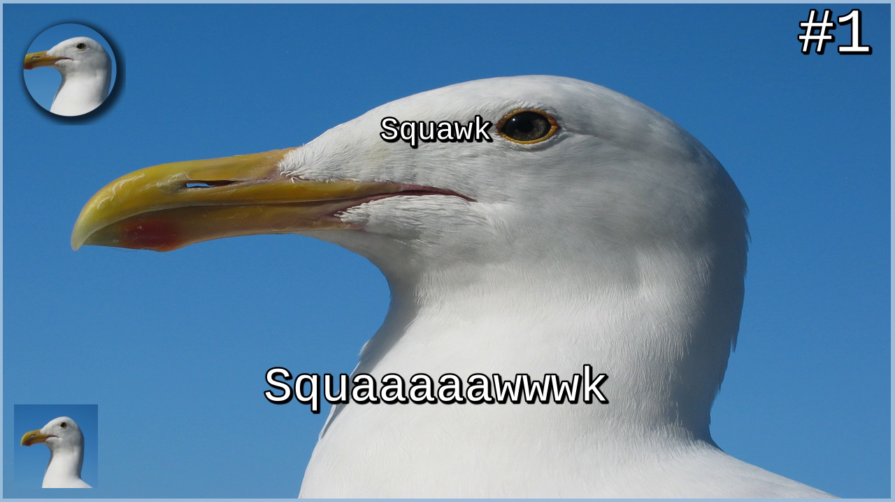

# Thumbnail generator
[](https://codecov.io/gh/SoTrxII/thumbnail-generator)
[](https://hub.docker.com/r/sotrx/create-thumbnail/)

API to generate thumbnails using presets (see [Presets](#presets)).
API definition is available here(TODO).

## Example 
The following request 
```json5
// GET function/create-thumbnail/thumb-rpg
// with body :
// Note : A GET request with a body is non-standard. All parameters can also be
// specified in the querysting. But as the QS limit of 2000 characters could
// be reached by some presets, a body is accepted
{
      "gmsAvatarUrl": ["https://upload.wikimedia.org/wikipedia/commons/9/9a/Gull_portrait_ca_usa.jpg"],
      "title": "Squawk",
      "episodeTitle": "Squaaaaawwwk",
      "episodeIndex": 1,
      "backgroundUrl": "https://upload.wikimedia.org/wikipedia/commons/9/9a/Gull_portrait_ca_usa.jpg",
      "logoUrl": "https://upload.wikimedia.org/wikipedia/commons/9/9a/Gull_portrait_ca_usa.jpg"
}
```
Would lead to the following result:


## Deploy
Using faas-cli:
```shell 
faas-cli deploy \
--image "sotrx/create-thumbnail:0.5.2"\
--name "create-thumbnail"\
--gateway <GTW_URL>
```

Using kubernetes:

```yml
# The "function" CRD must be installed on the cluster
# see https://github.com/openfaas/openfaas-operator
apiVersion: openfaas.com/v1
kind: Function
metadata:
  name: join-game
  namespace: openfaas-fn
spec:
  name: create-thumbnail
  image: sotrx/create-thumbnail:0.5.2
```

## Configure

No env variables are required to build the function.
Deploying
To deploy the functions, the simplest method is to use faas-cli.


## Project structure
```shell
├── assets/                               # Runtime assets.
│   ├── fonts
│   └── images
├── create-thumbnail/                     # Openfaas handler (Javascript)
├── src/                                  # Core (Typescript)
│   ├── internal/                         # Used only in the core
│   ├── pkg/                              # Meant to be used by the handler
├── template                              # Custom OpenFaas template
│   └── node17-media
└── thumbnail-generator.yml
```


## Presets and dynamic routing
To render a thumbnail, the function uses **preset**. A preset is a template defining how to handle data.
Each preset can define its own schema and has its own implementation.
At runtime a route parameter is used to define which preset is chosen.

Example:

````sh
/function/create-thumbnail/thumb-rp # Will use the preset "thumb-rpg"
````


## Development

###  Building the function


To build the function, multiple steps have to be executed :
- Transpile the Typescript code in Javascript to dist/
- Generate a shrinkwrap build for the function
- Copy the transpiled code into the function directory
- Copy/create yarn related file (lock, package.json, yarnrc)

This npm script is automating these steps:
```sh 
npm run build:f
```

### Modified OpenFaaS template

The template used for this function is derived from the *node17* official OpenFaaS template.
The Dockerfile has been modified in these ways :
- Add FFmpeg and some fonts to the alpine container
- Reducing the size of the Dockerfile by remove npm and upx'ing node binary
- Using yarn berry as a package manager

### Import trick

NodeJs `import` directive is used in package.json to bind the path `#core` to wherever the function core is.

In development, `#core` is bound to the folder `../dist/`.

In production (the function container), `#core` is bound to `./core`.

This allows to always use the latest transpiled version of the core. 
Jest, the test runner, doesn't yet support the `import` directive, and a `moduleNameMapper` has been created in jest.config.json
