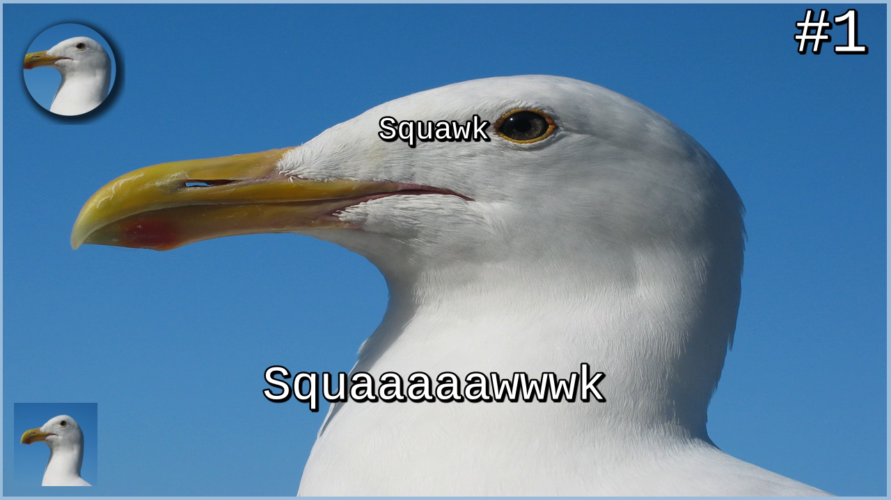

# Thumbnail generator

[](https://codecov.io/gh/SoTrxII/thumbnail-generator)
[](https://hub.docker.com/r/sotrx/create-thumbnail/)

This is a small YouTube thumbnail generator, using ffmpeg to overlay image and texts together.

## Example

The default request uses these parameters

```protobuf
message ThumbnailRequest {
  repeated string gmsAvatarUrl = 1;
  string title = 2;
  string episodeTitle = 3;
  int32 episodeIndex = 4;
  string backgroundUrl = 5;
  string logoUrl = 6;
}
```

The following request

```json5
{
  gmsAvatarUrl: [
    "https://upload.wikimedia.org/wikipedia/commons/9/9a/Gull_portrait_ca_usa.jpg",
  ],
  title: "Squawk",
  episodeTitle: "Squaaaaawwwk",
  episodeIndex: 1,
  backgroundUrl: "https://upload.wikimedia.org/wikipedia/commons/9/9a/Gull_portrait_ca_usa.jpg",
  logoUrl: "https://upload.wikimedia.org/wikipedia/commons/9/9a/Gull_portrait_ca_usa.jpg",
}
```

will lead to the following image :


## Configure

These env variables are available

| Name                | Description                                        | Default        |
| ------------------- | -------------------------------------------------- | -------------- |
| `PORT`              | The port to listen to                              | `3000`         |
| `LOG_LEVEL`         | The log level                                      | `debug`        |
| `DAPR_GRPC_PORT`    | Port to reach Dapr sidecar                         | `50001`        |
| `OBJECT_STORE_NAME` | Dapr component to reach the backend object storage | `object-store` |

## Run

```bash

# Run with Dapr, you will need dapr installed
npm run start:dapr
```
